

    <h1 id="readme-title">Anime Sama.fr Desktop</h1>
    <h4 id="readme-description">The anime-sama.fr desktop app!</h4>
    
    
    
    
    
    
    
    
    
    
    
    
    
    
    
    
    
    
    
    
    
    

<h3>Application</h3>
<table>
  <tr align="center">
    <td>Splash screen</td>
    <td>Home page</td>
  </tr>
  <tr align="center">
    <td>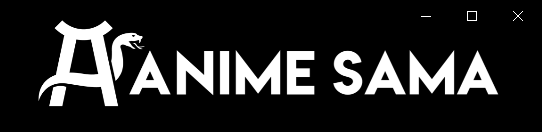</td>
    <td>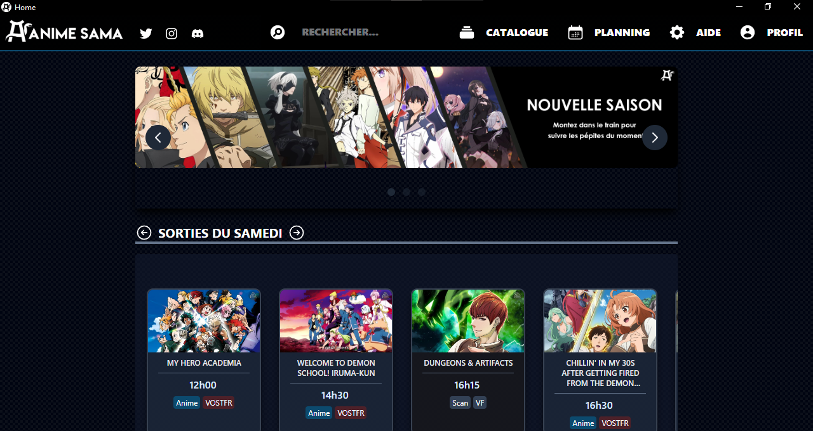</td>
  </tr>
  <tr align="center">
    <td>Catalog</td>
    <td>Info</td>
  </tr>
  <tr align="center">
    <td>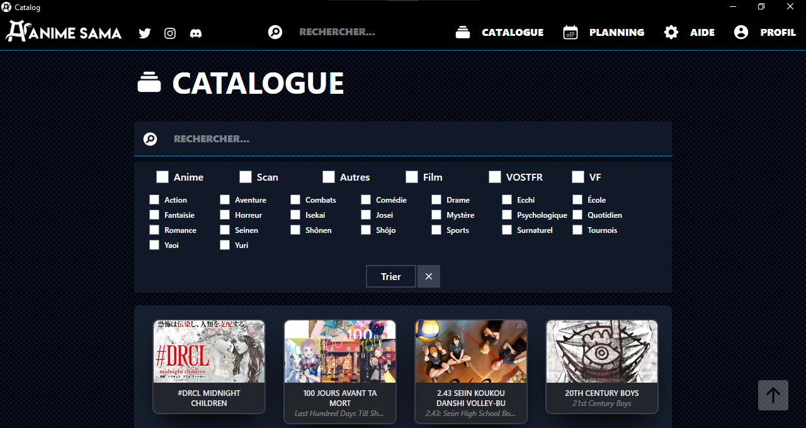</td>
    <td>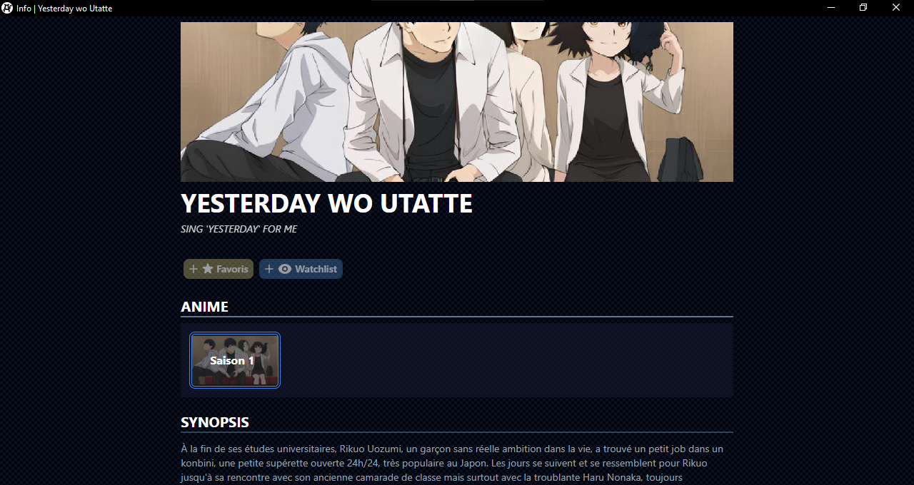</td>
  </tr>
  <tr align="center">
    <td>Watch</td>
  </tr>
  <tr align="center">
    <td>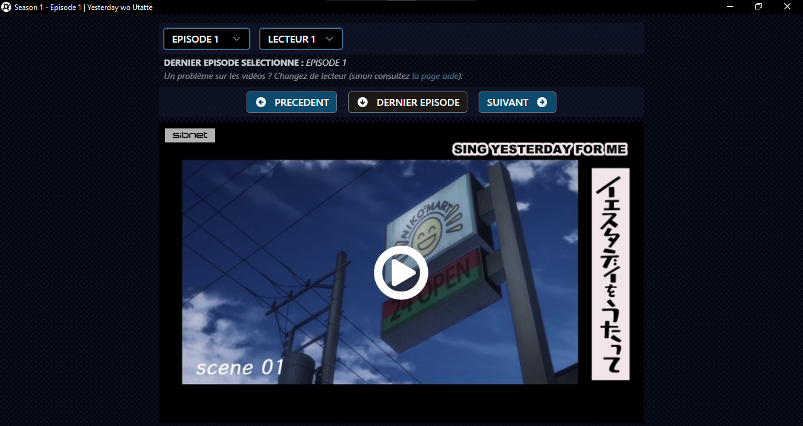</td>
  </tr>
</table>
<h3>Tray</h3>
<table>
  <tr align="center">
    <td>Main</td>
    <td>Import/Export</td>
	<td>Actions</td>
  </tr>
  <tr align="center">
    <td>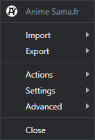</td>
    <td>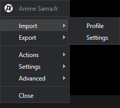</td>
    <td>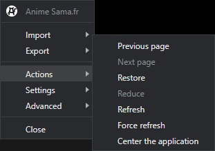</td>
  </tr>
  <tr align="center">
    <td>Settings</td>
	<td>Advanced</td>
  </tr>
  <tr align="center">
    <td>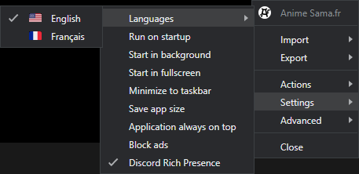</td>
    <td>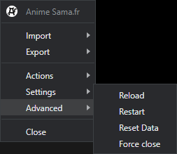</td>
  </tr>
</table>
<h3>Discord Rich Presence</h3>
<table>
  <tr align="center">
    <td>Any page</td>
    <td>Info</td>
	<td>Watch</td>
  </tr>
  <tr align="center">
    <td>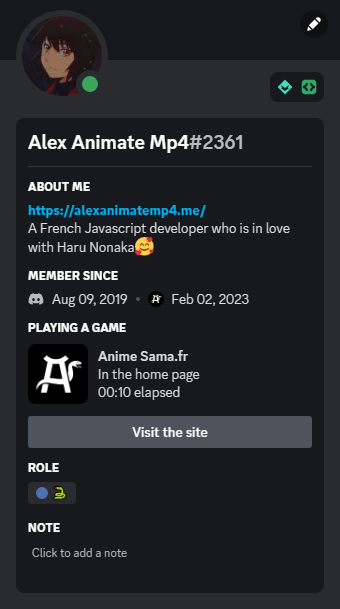</td>
    <td>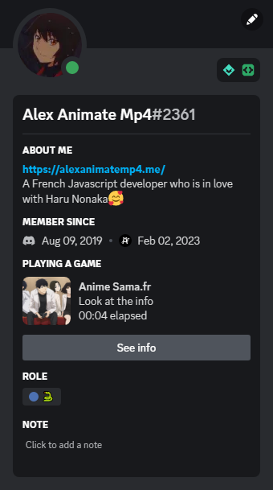</td>
    <td>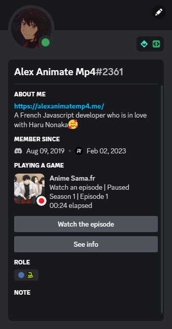</td>
  </tr>
</table>

CL 2022 <a id="readme-footer-repo" href="https://github.com/AlexAnimateMp4/anime-sama-fr-desktop">Anime Sama.fr Desktop</a> &lt;/&gt; with ❤ by <a id="readme-footer-author" href="https://alexanimatemp4.me" target="_blank">Alex Animate Mp4</a> and <a id="readme-footer-contributors" href="https://github.com/AlexAnimateMp4/anime-sama-fr-desktop/graphs/contributors">contributors</a>.

